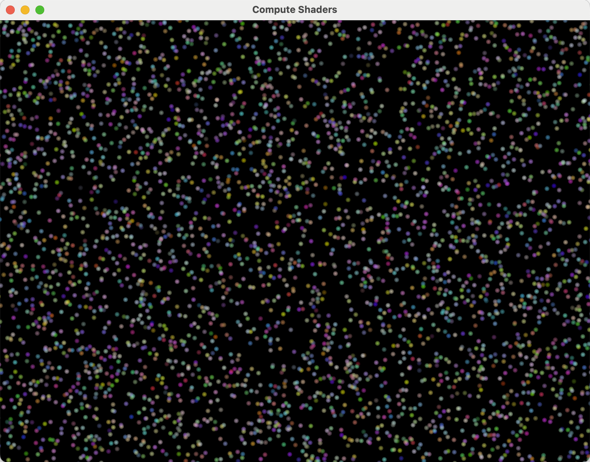

# Vulkan Compute Shader Tech Demo



## Introduction
This repository is a tech demo for Vulkan compute shaders.

## Features
The demo has some extra features of interest. 
* A custom set of **cmake** modules for compiling and building HLSL and GLSL 
  shaders at build time.
* All shaders have both HLSL and GLSL versions.


## Getting Started
In order to compile and run this demo, your system needs to have a Vulkan
SDK installed on the system. In particular, on macOS, you need something
like LunarG's Vulkan SDK to work. In summary, you need

* A Vulkan SDK that supports Vulkan 1.3.
* A C/C++ compiler that can compile C++20, such as **clang**, **msvc**, or **gcc**.
* The **cmake** build system with minimum version `3.28`.

Knowing that **cmake** is a difficult creature on a good day, here are some
instructions to build the demo to make things simpler to get moving with.

## Compiling The Demo

To compile the demo, run

```bash
cmake -B build
cmake --build build
```

and it should compile.

## Running The Demo

To run the demo, run
```bash
cmake --build build --target run
```
or if you're feeling a little lazy
```bash
./bin/*
```

and the demo should launch.

## Cleaning Up The Build Tree

To clean the build artifacts for the demo, run

```bash
rm -rf build
rm -rf bin
```

and you're done.
